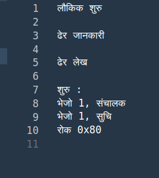
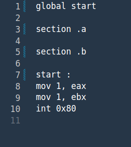

# HASM
This Python program translates assembly likr programs written in hindi to asm code.

# How To Use
1. `Clone the repo`
2. `cd into repo`
3. `Run python3 hasm.py input_file`

# Example Code
Test folder contains example programs and various references with their english counterparts.  

 

# TODOs (Contributions)
1. Implement hindi labels
2. Expansion of current set of keywords
3. Error handling in parser
4. Converting hindi code directly to object code
5. More and complex examples